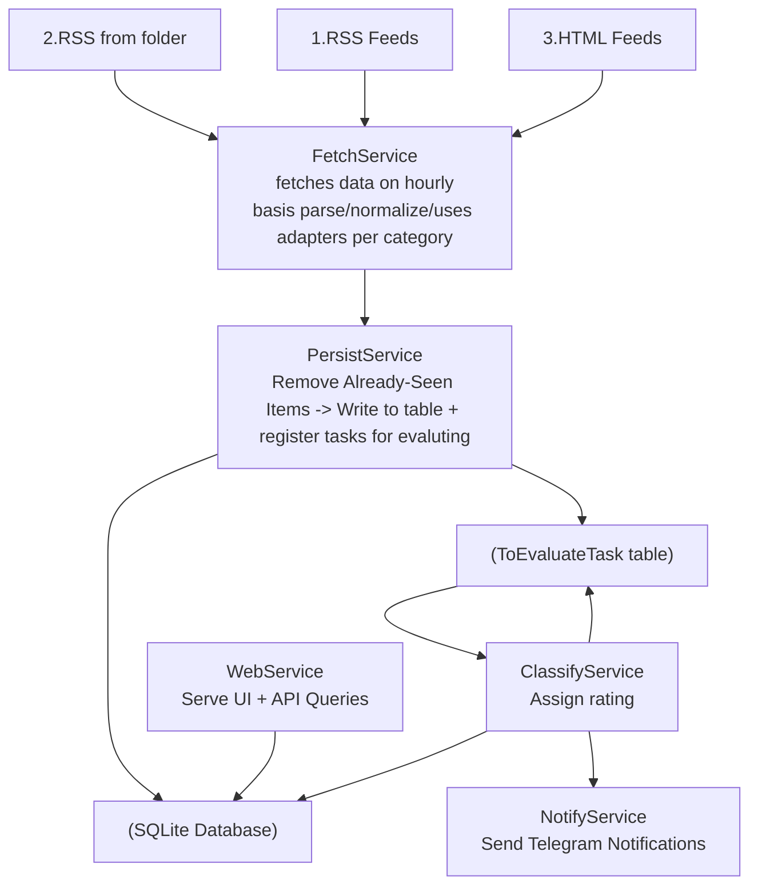

# Website / RSS Parser - Technical Specification

## Overview
A Go-based Html/RSS parser that fetches, parses, stores, and displays parsed items with a web UI for browsing and filtering.

## High-Level Data Flow




## Data Structures

```go
type ParsedItem struct {
    id          string    //  
    Link        string    // Link to parsed item
    Title       string    // Item title
    PubDate     time.Time // Publication date
    Description string    // Full HTML description
    Brand       string    // Extracted brand (e.g., "Dell", "Samsung")
    Model       string    // Extracted model (e.g., "Latitude 5420")
    Price       int       // Extracted price (e.g., "450")
    Arguments   json
    ImageURL    string    // Extracted image URL
    Category    Category    // Defines 
    Properties  []Property
    ProcessedAt time.Time
}

type Category struct { // each category has its own parser with logic and extracted Properties
    name        string    // name 
    props    []PropertyMeta  // supported properties
}

type PropertyMeta struct { 
    id         int    
    name       string    // name 
    type       string    // string, number, date, 
}

type Property struct { 
    id         int    
    propertyMeta         PropertyMeta    
    value      string    
}
```

### Filter 
```go
type Filter struct {
    Category string  // Exact match on category
    Brand    string  // LIKE match on brand
    Search   string  // LIKE match on title/description
    MinPrice float64 // Price >= MinPrice
    MaxPrice float64 // Price <= MaxPrice
    PubDate  time.Time // Publication date
    Limit    int     // Result limit (default: 100)
    Offset   int     // Pagination offset
    Order    desc
}
```


## Technology Stack

### Core
- **Language**: Go 1.22+
- **Database**: SQLite (modernc.org/sqlite - pure Go, no CGO)
- **Web Framework**: Native `net/http` with `html/template`
- **Scheduling**: Custom ticker-based scheduler (time.NewTicker)

### Key Libraries
- `modernc.org/sqlite` v1.29.5 - Pure Go SQLite driver
- `gopkg.in/yaml.v3` v3.0.1 - YAML configuration parsing
- Standard library: `encoding/xml`, `net/http`, `regexp`, `time`

### Frontend
- Vanilla JavaScript (ES6+)
- Native Fetch API for AJAX
- CSS Grid for responsive layout
- No external dependencies

### Deployment
- **Windows**: PowerShell batch scripts (start.bat, stop.bat, restart.bat, build.bat, open.bat)
- **Port**: 8080 (configurable via config.yaml)


There could be multiple data categories 